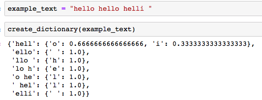

# A project to generate song lyrics using markov chains
This is a probabilistic model that uses markov chains to generate song lyrics. Markov chains are based on the principle of 'memorylessness'. The next state
of the process depends only on the present state and not on sequence of states.

For example, lets say that you have to make markov chain model of weather conditions(rainy or sunny) and you have four probabilities:-

  P(R->R) : Probability of a rainy day after a rainy day = 0.5

  P(R->S) : Probability of a sunny day after a rainy day = 0.5

  P(S->S) : Probability of a sunny day after a sunny day = 0.9

  P(S->R) : Probability of a rainy day after a sunny day = 0.1
  
Then the markov model will look like this:-

We can structure this in the form of a simple transition table 

|   weather | Sunny   |  Rainy |
|:-------:| :--------:|:------:|
|Sunny    |     0.9   |     0.1|
|Rainy    |     0.5   |     0.5|

## Steps:c
1) In this project, The first Step was to create a transition table. The transition table describes the probability distribution of of given text(lyrics).
Each 'K' characters in the text(lyrics) act as a key in dictionary. Then for each key('K' characters in the text ) we again create a dictionary of what the next
predicted character can be, we count the occurence of each type of predicted character and find the probability.

2) After we have created the dictionary of probabilities(transition table), The next step is to sample new characters based on the dictionary of probabilities. For sampling we will not just return the next character with highest probability as this will not allow other characters to be generated.
So, for sampling we use np.random.choice() which returns a random element of a given list based on probability provided

 
## Note:
- Markov chain may be able to mimic the writing style of an author based on word frequencies, it would be unable to produce text that contains any meaning. We can use it to generate similar looking lyrics, code, speech, novel ,etc.

- While it can generate similar looking content, this content is not context dependent. It can only replicate the  authors writing style based on word frequencies.

